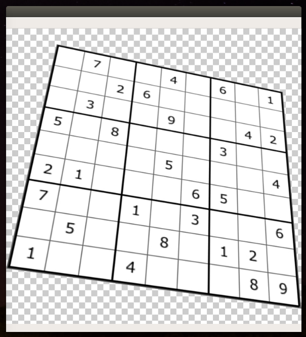
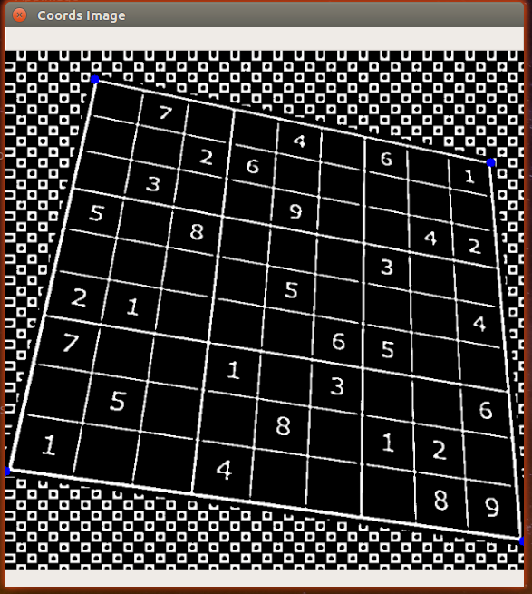
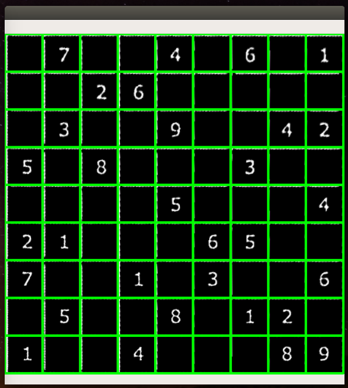
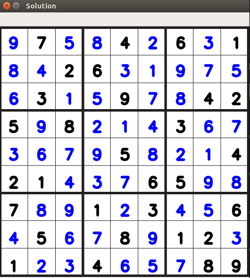

# Sudoku-Solver-OpenCV-CNN
Solving the sudoku puzzle using **image processing**, **artificial intelligence** and the **backtracking algorithm**!

## Table of Contents
1. [Usage](#usage)
2. [Procedure](#procedure)
3. [Scripts](#scripts)
4. [Limitations](#limitations)
5. [Future Development](#future-development)

## Usage
Download the repository and run the following command :`python solver.py`  
This will start up the code and ask for a filepath as input. (`./boards/sudoku6.jpg`)

## Procedure
### 1) Image Processing
The image is converted to grayscale and further Adaptive Thresholding and Dilation are applied to the image to reduce noise and enhance contours. After this happens, the coordinates of the maximum area (the sudoku grid) in the image are found. 

### 2) Warping
Using the coordinates found, we warp the image and form individual grids on the image.These individual grids will help in extracting out the smaller tiles which contain a single digit or a blank.

### 3) Digit Recognition
The individual grids are passed into a convolutional neural network (Christopher) which is pretrained on a custom dataset. These grids are identified and returned in the form of a list.

### 4) Backtracking
The predictions are fed into a script which solves the sudoku using the Backtracking algorithm and the solution is shown on an empty sudoku grid.

## Scripts
### christopher.py
This script consists of a Convolutional Neural Network trained on a custom dataset. 

### basic.py
This script is used to take as input the original image, apply preprocessing, get the corner points of the board, warp the image and seperate out the individual smaller grids(tiles) containing the individual digits/blanks

### sud.py
This script is used to take the individual tiles, does a bit of preprocessing and predict the digits in each tile. As the grid is a 9x9, the number of tiles are 81.

### solver.py
This script consists of the backtracking algorithm used to solve the sudoku puzzle. After the predictions are made, they are fed into this script. The final board is than printed onto a blank sudoku grid image.

## Limitations
The model isn't perfect. It isn't able to detect all the digits in every single image provided.

## Future Development
1. Adding in the ability to solve the puzzle in real-time via webcam
2. Applying augmented reality!
